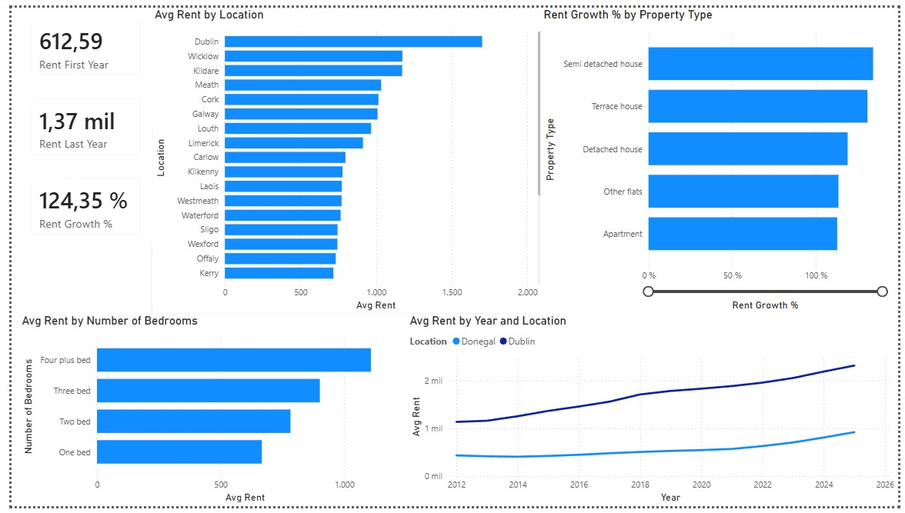
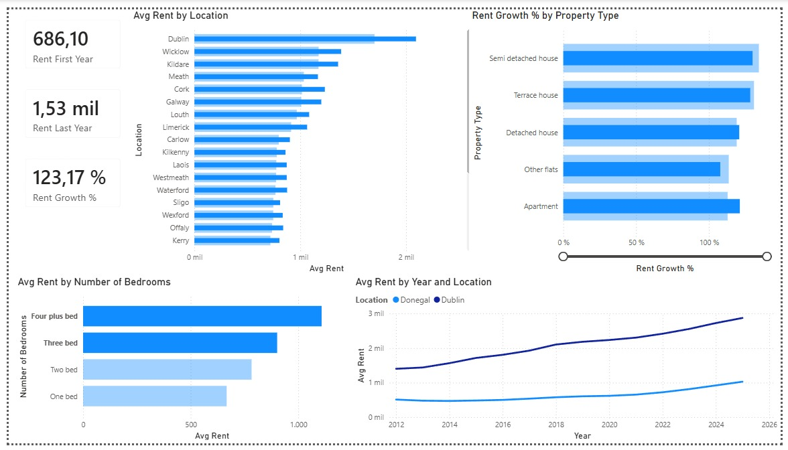
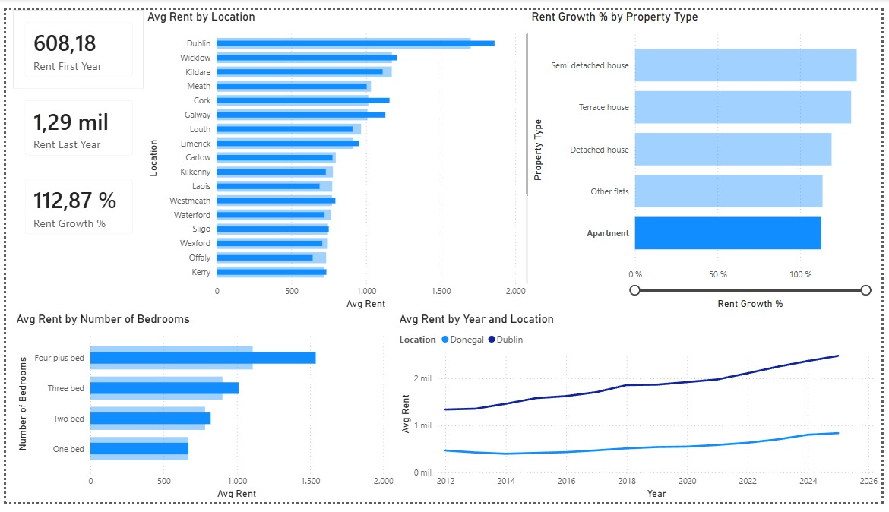

# Ireland Rental Market Analysis

An end-to-end data analysis of Ireland's residential rental market between **2012 and 2025**, built with **Power Query**, **Power BI**, **DAX** and **Excel**. The project explores how rent prices evolved across counties, property types and household sizes, using official data from the Residential Tenancies Board (RTB) published by Ireland's Central Statistics Office (CSO).

## Live dashboard

**[View the interactive dashboard →](https://app.powerbi.com/view?r=eyJrIjoiODA2NGJlNDItMjVlNC00YmNjLWE5ZjgtY2Y4OTI0MmU3ZjE5IiwidCI6IjRjODE4Zjc5LWFiODQtNDU1Mi05YjdjLTJmZTcxNWIwZDBkNSIsImMiOjR9)**



## Objective

The analysis was built around two concrete questions defined before touching the data:

1. **Which property type increased in price the most over the period?**
2. **Which counties are the most affordable for family housing (3+ bedrooms), and how did the gap with Dublin evolve over time?**

## Data source

- **Dataset:** RIQ02 — *RTB Average Monthly Rent Report*
- **Provider:** Central Statistics Office (CSO), Ireland — [data.cso.ie](https://data.cso.ie)
- **Granularity:** quarterly, by location, property type and number of bedrooms
- **Period:** 2012–2025

## Process

**Data cleaning (Power Query).** The raw dataset mixed geographic levels in the `Location` field (counties, postal districts and neighbourhoods). Since the RTB already computes county-level averages, the data was filtered to keep only the 26 Irish counties as standalone values, using a whitelist approach with `List.Contains`. Constant columns (`STATISTIC Label`, `UNIT`) were removed. Aggregated categories that overlap with individual ones (e.g. "All bedrooms", "1 to 3 bed", "All property types") were excluded to avoid double counting. Null values in the rent field — combinations with no official RTB data — were removed. The `Quarter` field was split into `Year` and `Quarter` to enable time-based analysis.

**Modeling (DAX).** Measures were built to calculate average rent, first- and last-year averages, and percentage growth across the period:

```dax
Avg Rent = AVERAGE('Clean data'[Rent])

Rent First Year = CALCULATE([Avg Rent], 'Clean data'[Year] = 2012)

Rent Last Year = CALCULATE([Avg Rent], 'Clean data'[Year] = 2025)

Rent Growth % = DIVIDE([Rent Last Year] - [Rent First Year], [Rent First Year])
```

Because measures recalculate by context, the same `Rent Growth %` reveals growth by property type, by county or by bedroom count depending on the visual it sits in.

## Key findings

**1. Rents more than doubled nationally.** Average monthly rent grew from **€612.59 (2012)** to **€1,370 (2025)** — a **124% increase** across all property types and counties.

**2. All property types rose sharply and fairly evenly.** Semi-detached houses grew the most (**+134%**) and apartments the least (**+112.87%**). The spread between the top and bottom type is narrow, so the dominant story is broad, uniform growth rather than one type running away from the rest.



**3. Donegal is the most affordable county for family housing.** For homes with 3+ bedrooms, Donegal shows the lowest average rent. (Hypothesis: distance from major urban and economic centres — not verified within this dataset, which only contains rent figures.)

**4. The Dublin gap widened.** Dublin has the highest average rent throughout the period and grew more than proportionally compared to counties like Donegal. For family homes, the absolute monthly gap between Dublin and Donegal roughly doubled over the period, while the proportional ratio stayed close to 2.7x.



## Limitations

- Null rent values were excluded because they represent combinations with no official RTB data. This reduces coverage for smaller counties and less common property types, so those counties rely on fewer underlying records.
- The dataset contains rent figures only. Explanations involving employment, demand or purchasing power are hypotheses, not conclusions supported by this data.
- The analysis uses rental data, not sale prices, so it speaks to affordability of renting — not to property investment decisions.

## Tools

- **Power Query** — data cleaning and transformation
- **Power BI** — modeling and visualization
- **DAX** — calculated measures
- **Excel** — initial data inspection

---


Project by Lautaro Reche.

- [LinkedIn](https://www.linkedin.com/in/lautaroreche/).
- [GitHub](https://github.com/lautaroreche).
- [Portfolio](https://lautaroreche.github.io/).